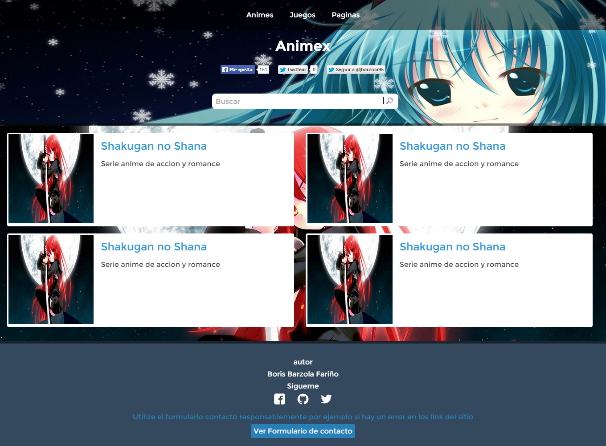
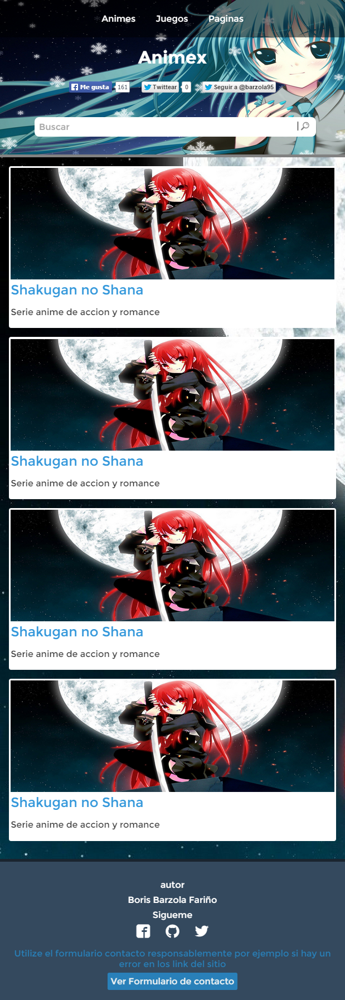

<h1>Animex</h1>

Muchos maquetamos muchos sitios para empresas, negocios, etc.

Este es mi proyecto personal utilizando HTML5 y CSS3. En realidad use stylus para compilar el css de este sitio porque su lectura es mas legible.

Diseño del sitio escritorio

<figure>
  
</figure>

Diseño movil del sitio

<figure>

</figure>

El utilizar responsive design ahora tiempo y esfuerzo. El que no tenga conocimiento de reponsive design solo es un diseño ajustable, por ejemplo si hacen pequeño su navegador el sitio web se ajustara al tamaño actual

